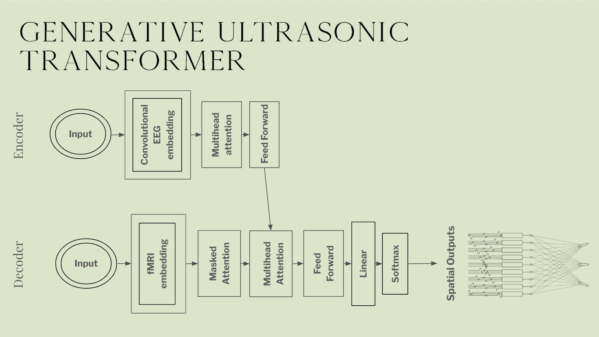

[](https://discord.gg/qUtxnK2NMf)

# Morpheus 1



Implementation of "MORPHEUS-1" from Prophetic AI and "The world’s first multi-modal generative ultrasonic transformer designed to induce and stabilize lucid dreams. "


## Installation

```bash
pip install morpheus-torch
```

# Usage
- The input is FRMI and EEG tensors.

- FRMI shape is (batch_size, in_channels, D, H, W)

- EEG Embedding is [batch_size, channels, time_samples]

```python
# Importing the torch library
import torch

# Importing the Morpheus model from the morpheus_torch package
from morpheus_torch.model import Morpheus

# Creating an instance of the Morpheus model with specified parameters
model = Morpheus(
    dim=128,                # Dimension of the model
    heads=4,                # Number of attention heads
    depth=2,                # Number of transformer layers
    dim_head=32,            # Dimension of each attention head
    dropout=0.1,            # Dropout rate
    num_channels=32,        # Number of input channels
    conv_channels=32,       # Number of channels in convolutional layers
    kernel_size=3,          # Kernel size for convolutional layers
    in_channels=1,          # Number of input channels for convolutional layers
    out_channels=32,        # Number of output channels for convolutional layers
    stride=1,               # Stride for convolutional layers
    padding=1,              # Padding for convolutional layers
    ff_mult=4,              # Multiplier for feed-forward layer dimension
)

# Creating random tensors for input data
frmi = torch.randn(1, 1, 32, 32, 32)    # Random tensor for FRMI data
eeg = torch.randn(1, 32, 128)           # Random tensor for EEG data

# Passing the input data through the model to get the output
output = model(frmi, eeg)

# Printing the shape of the output tensor
print(output.shape)


```


### Code Quality 🧹

- `make style` to format the code
- `make check_code_quality` to check code quality (PEP8 basically)
- `black .`
- `ruff . --fix`

# License
MIT

# Todo
- [ ] Implement the scatter in the end of the decoder to output spatial outputs which are 4d?

- [x] Implement a full model with the depth of the decoder layers

- [ ] Change all the MHAs to Multi Query Attentions

- [ ] Double check popular brain scan EEG and FRMI AI papers to double check tensor shape

